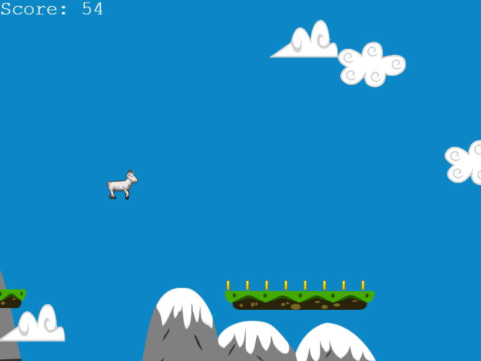
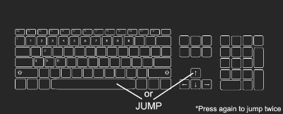

# Billy the Jumper

Billy the Jumper is a simple platform game with scaling difficult that challenges the player.

## Screenshot



## Live version

[Live version](https://billy-the-jumper.herokuapp.com/)

## Getting Started

Clone the repository into your local computer.

```
$ git clone https://github.com/kazumaki/billy-the-jumper.git
```

### Installing

First, you'll have to install the newest version of [Node](https://nodejs.org/en/download/). Otherwise, the npx command could not be available. Then move into the project main directory on the console and follow the instructions below. 

Install all packages:

```
$ npm install
```

Run Webpack:

```
$ npx webpack
```

Run local webserver

```
$ npm run start
```

Now in your browser type the following address and press enter.

```
http://127.0.0.1:8080
```

You can instruct webpack to "watch" all files within your dependency graph for changes. If one of these files is updated, the code will be recompiled so you don't have to run the full build manually:

```
$ npx webpack --watch
```

### webpack.config.js

The main file of which the bundle is created is set in the entry:

```
entry: './src/index.js'
```

The output file of the JavaScript bundle and its name is set in the output:

```
output: {
  filename: 'app.bundle.js',
  path: path.resolve(__dirname, 'build'),
},
```

[From Webpack documentation:](https://webpack.js.org/guides/production/) Technically, NODE_ENV is a system environment variable that Node.js exposes into running scripts. It is used by convention to determine dev-vs-prod behavior by server tools, build scripts, and client-side libraries. Contrary to expectations, process.env.NODE_ENV **is not set to "production"** within the build script webpack.config.js. Thus, conditionals like `process.env.NODE_ENV === 'production' ? '[name].[hash].bundle.js' : '[name].bundle.js'` within webpack configurations do not work as expected.

### Playing the game
The goal of the game is simple: you have to jump between the platforms and make sure that Billy (Goat) doesn't fall.

#### Jump Commands
* Spacebar
* Up Arrow key
* Left Mouse Button

You can jump twice if you press jump command again (Take care to not hold the button and jump twice without necessity).

 

#### Score system
Your total score is based on the amount of time you stay alive, for the first 30 seconds, you gain approximately 1 point for each second alive, these values double every 30 seconds, so the next 30 seconds you'll gain 2 points for each second and so on.

The coins also give 1 point each so don't forget to collect as many as you can.

## Game Development

### Done

The main goal when I started to develop Billy The Jumper was to create a simple platform game with an endless level, and I had to do it in only five days. I came with a lot of ideas in the first brainstorming session that I was unable to add to the game cause of the lack of time. So what I did was focusing on the basic gameplay development on the first three days, where I developed the basic game flow with a jumper character and auto-generated platforms using Phaser physics functionalities helped a lot. In the last two days, I focused on improving the actual game with better graphics and sound effects, like when the character jumps or die, menu hovering or select an option, added some graphics at the background to create the sense of moving, and also implemented high scores system using Leaderboard API system.

### Ideas for improvement

* Add collectibles items that grant buffs
* Pause system
* Save options to the localStorage
* Multiplayer online gameplay

## Built With

* [JavaScript](https://www.javascript.com/) - Programming language used
* [Phaser 3](https://phaser.io/phaser3) - Canvas and WebGL framework used
* [Webpack](https://webpack.js.org/) - Bundler used
* [HTML](https://en.wikipedia.org/wiki/HTML) - Hypertext Markup Language
* [VS Code](https://code.visualstudio.com/) - The code editor used
* [Piskel](https://www.piskelapp.com/) - Animated sprite editor

## Assets

* ["LPC Goat" by bluecarrot16](https://opengameart.org/content/lpc-goat) - Goat graphics used
* ["Happy Loops sounds" by Goose Ninja](https://gooseninja.itch.io/happy-loops) - Loop sounds used
* ["16 / 8 bit soundpakc" by JDWasabi](https://jdwasabi.itch.io/8-bit-16-bit-sound-effects-pack) - Sound effects used
* ["Platform Tiles" by Akshay V](https://opengameart.org/content/platformer-tiles-2) - Platform tiles used
* ["Parallax Mountain Background" by GrumpyDiamond](https://opengameart.org/content/parallax-mountain-background) - Parallax Effect mountain graphics used
* ["Cute Clouds Game Ornament" by bevouliin.com](https://opengameart.org/content/cute-clouds-game-ornament) - Cloud graphics used
* ["Rotating Coins" by Puddin](https://opengameart.org/content/rotating-coin) - Coin graphics used 
## Author

👤 **Vinicius Campos Carvalho**

<a href="https://github.com/kazumaki" rel="noopener noreferrer" target="_blank">

   

</a>

- Github: [@kazumaki](https://github.com/kazumaki)
- Twitter: [@iKazumaki](https://twitter.com/iKazumaki)
- Linkedin: [Vinicius Campos Carvalho](https://www.linkedin.com/in/vcamposcarvalho/)
- Email: [vcampos.pitangui@gmail.com](vcampos.pitangui@gmail.com)

## License

This project is licensed under the MIT License - see the [LICENSE](LICENSE) file for details

## Acknowledgments

* [Project Requirements page](https://www.notion.so/Platform-game-4a55a7d1fcc245bcb012c76814764712)
